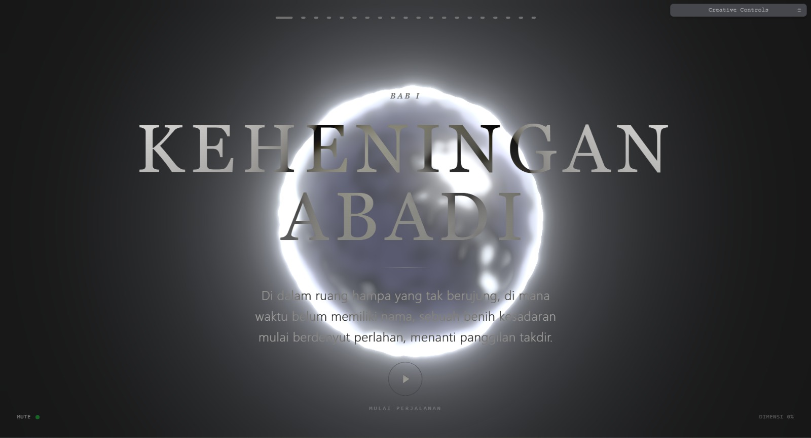

# ODYSSEY | Creative Coding Experiment



> *“Di dalam ketiadaan, sebuah nafas berhembus perlahan.”*

**ODYSSEY** adalah sebuah eksperimen visual dan audio interaktif berbasis web yang menggabungkan seni generatif, narasi puitis, dan teknologi web modern. Proyek ini mengajak pengguna menelusuri perjalanan evolusi digital dari ketiadaan menuju harmoni melalui 20 bab naratif yang imersif.

## ✨ Fitur Utama

- **Procedural 3D Visuals**: Organisme digital yang dibuat sepenuhnya dengan kode (Three.js & GLSL Shaders), berevolusi secara real-time.
- **Epic Scale Narrative**: 20 Bab perjalanan (Genesis, Energy, Chaos, Harmony) dengan deskripsi puitis dalam Bahasa Indonesia.
- **Generative Audio**: Sistem audio ambien (Tone.js) yang bereaksi dan berubah secara dinamis di setiap bab.
- **Reactive State**: Dibangun di atas **Svelte 5 Runes** untuk manajemen state yang ultra-responsif.
- **High Performance**: Optimasi lazy-loading, post-processing (Bloom) efisien, dan PWA-ready.
- **Cinematic Experience**: Auto-Play ("REC") mode dengan kontrol kecepatan variabel (0.5x - 16x), tipografi elegan, dan animasi halus.
- **Fully Responsive**: Berjalan mulus di desktop dan mobile dengan kontrol sentuh adaptif.

## 🛠️ Stack Teknologi

Proyek ini dibangun dengan standar teknologi web terkini:

- **Framework**: [SvelteKit 2](https://kit.svelte.dev/) (Svelte 5)
- **3D Engine**: [Three.js](https://threejs.org/)
- **Shaders**: Custom GLSL (Vertex & Fragment)
- **Animation**: [GSAP](https://greensock.com/gsap/)
- **Audio**: [Tone.js](https://tonejs.github.io/)
- **Styling**: [Tailwind CSS 4](https://tailwindcss.com/)
- **Monitoring**: [Vercel Speed Insights](https://vercel.com/docs/speed-insights)
- **Languages**: TypeScript

## 🚀 Cara Menjalankan

Pastikan Anda memiliki Node.js (v18+) terinstal.

1.  **Clone Repository**
    ```bash
    git clone https://github.com/username/my-world.git
    cd my-world
    ```

2.  **Install Dependencies**
    ```bash
    npm install
    ```

3.  **Jalankan Development Server**
    ```bash
    npm run dev
    ```

4.  **Build untuk Produksi**
    ```bash
    npm run build
    ```

## 🎮 Interaksi
- **Play / Pause**: Tombol tengah di bagian bawah untuk memulai atau menghentikan perjalanan otomatis.
- **Scroll Manual**: Ambil alih kendali kapan saja dengan scroll mouse atau sentuhan.
- **Kecepatan**: Atur tempo perjalanan dari **0.5x** (Meditatif) hingga **16x** (Hyper Drive) melalui panel kontrol kanan atas.
- **Audio**: Toggle Mute/Unmute di pojok kiri bawah.
- **Creative Controls**: Panel *Tweakpane* tersembunyi untuk memanipulasi parameter visual secara langsung.

## 🎨 Struktur Narasi

Perjalanan dibagi menjadi 4 Era Utama, masing-masing terdiri dari 5 Bab:

| Era | Tema | Karakteristik Visual | Audio |
| :--- | :--- | :--- | :--- |
| **I. GENESIS** | Awal Mula | Gelap, Partikel Halus, Void | Deep Drone, Reverberant |
| **II. ENERGY** | Pergerakan | Emas, Aliran Cepat, Kompleks | Arpeggios, Rising Tempo |
| **III. CHAOS** | Konflik | Merah, Distorsi, Glitch, Tajam | Dissonant, High Feedback |
| **IV. HARMONY** | Resolusi | Mutiara, Halus, Reflektif, Tenang | Major Chord, Pure Wash |

---

**Created with ❤️ by MikeuDev**
*Digital Art Experiment 2025*
